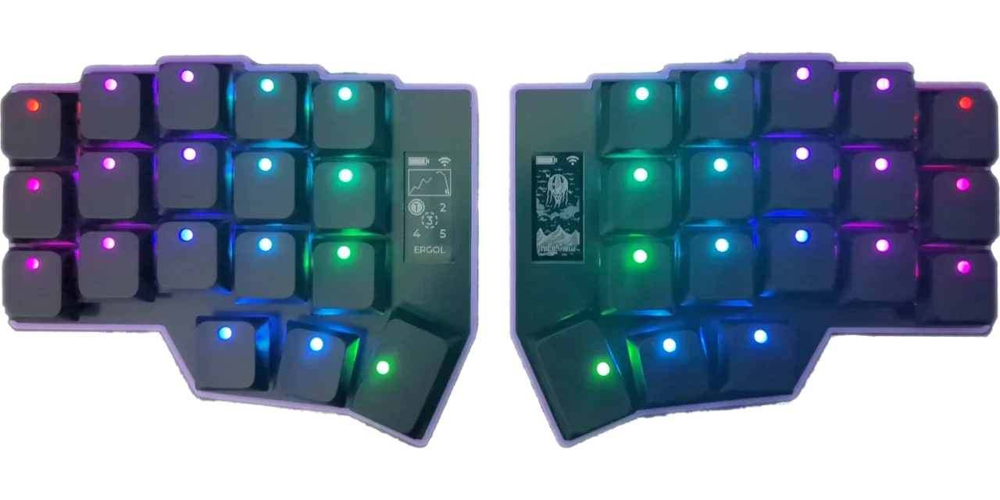
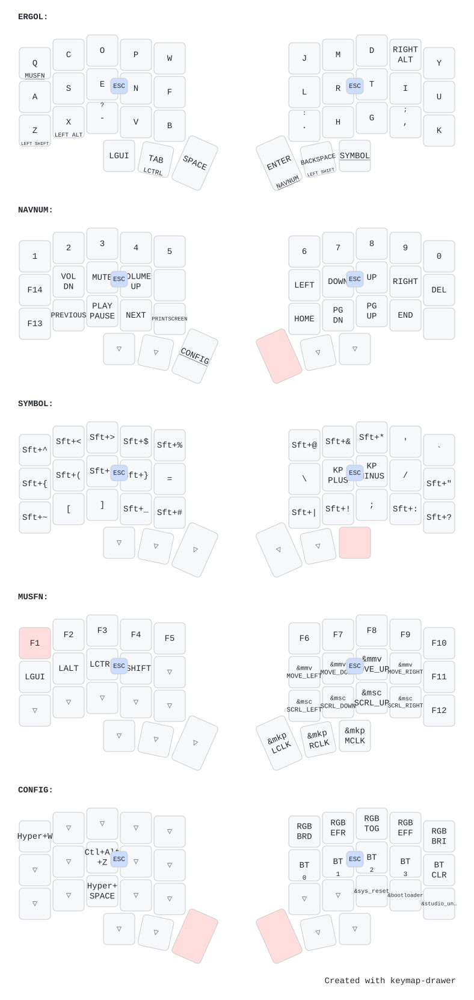

# ⌨️ zmk-config

ZMK config for my 5-col crkbd with nice!view display keyboard.

## Specs

These are the keyboard specs:

- Keyboard: [Corne (foostan/crkbd)](https://github.com/foostan/crkbd) (v4.1)
- Total keys: 36 (2 x (3 × 5 + 3))
- Type: Wireless (Bluetooth)
- Switches: [Kailh Choc v2 Red](https://www.kailh.net/products/kailh-choc-v2-low-profile-switch-set)
- Keycaps: [LPF Dot Glow](https://www.keebart.com/products/lpf-dot-glow-keycaps)
- Firmware: [ZMK](https://zmk.dev/)
- Vendor: [Keebart](https://www.keebart.com/) ([keyboard reference](https://www.keebart.com/products/corne-wireless))
- RGB Lighting: yes
- Displays: [nice!view](https://nicekeyboards.com/nice-view/)

## Keymap

## Previous keyboard

This 36 keys corne pro was not my first ergo keyboard.

My previous keyboards:

- [46 keys wired Corne](https://github.com/coko7/crkbd)
- [58 keys wired Sofle](https://github.com/coko7/sofle)
